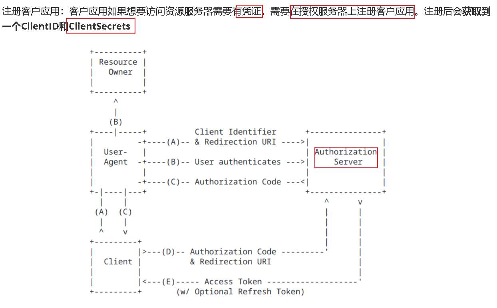

# **AuthN (Authentication)**

## **账号 密码**

**密码存储：摘要算法md5 以及 加盐**

## **Token**

### **单token机制**

实现方向上：JWT为常见

JWT结构 算法：

实践上

**不足之处：**

​        **1.令牌过期问题：单一令牌机制可能存在过期问题。如果令牌的有效期太长，可能会增加安全风险；而如果有效期太短，用户可能需要频繁地重新登录。解决方法可以是使用短期令牌，并结合刷新令牌机制来延长会话时间。**

​        **2.令牌泄露风险：一旦令牌泄露，黑客可以使用该令牌冒充用户进行操作。为了减少泄露风险，可以采用HTTPS传输协议，并在令牌中包含较少敏感信息，以及采用其他安全机制如IP限制或设备识别等。**

​        **3.单点故障：如果使用单一令牌机制，一旦令牌被篡改或失效，用户可能需要重新登录所有相关的服务。使用分布式令牌管理系统或者采用多因素身份验证可以降低这种风险。**

​        **4.跨设备登录问题：如果用户在多个设备上登录，可能需要频繁刷新或重新获取令牌。这可能会增加用户体验的复杂性。可以考虑使用多设备登录管理机制或长期持久化令牌来解决这个问题。**

​        **5.权限控制不灵活：单一令牌机制可能无法灵活地控制不同用户或不同角色的权限。在这种情况下，可以结合使用令牌和访问控制列表（ACL）等机制来实现更灵活的权限管理。**

**安全性较低（因为只有一个token在客户端和服务器端之间进行传递，一旦Access Token被截获或者被泄露，攻击者就会在有效时间内完成模拟用户行为，访问所有受保护资源）**

**短有效期策略限制无法撤销会话（为了提高安全性access token通常设置的时间是比较短的，然而需要频繁的去获取access token，影响的是用户的体验，尤其是长时间操作或者是后台的服务场景下就会遇到一个瓶矜，而且也无法撤销对应的汇报，如果某个token被盗用了，难以立即撤销这个token的有效性，从而不能立即中断攻击者的访问权限）**

**无代态刷新问题（若要自动去刷新token维持长期的绘画，**单token的机制需要将刷新的逻辑耦合到具体的业务流程当中**，这就会增加复杂性和潜在的安全风险）**

**没有权限细分管理（单一的access token包含所有的授权信息，不易于对不同范文或者是力度的一个资源进行精细化的访问控制）**

### **双Token机制**

**操作机制：双Token主要包含了AccessToken (访问令牌) 和 RefreshToken (刷新令牌)，它的出现就是为了解决单token的不足，所以才会引入双token的机制也就是 RefreshToken (刷新令牌)，因为它可以延长实际的绘画时间，用户提供了一种安全的方式来去更新AccessToken，并且在必要的时候撤销特定用户的权限，而并不会影响有效的绘画内容。**

**实时上双token的机制是 oos 2.0标准中常见的一种实现，主要包含两个类型的token，一个是AccessToken (访问令牌) ，一个是RefreshToken (刷新令牌)**

**AccessToken (访问令牌)：它会设置一个有效时间较短的令牌内容，用于的是用户每次请求受保护资源时，进行身份验证的操作，通常直接包含在api请求头或者是URL地址参数之中，用于证明客户端其实是有权限去访问特定的资源的**

**RefreshToken (刷新令牌)：刷新令牌，会设置一个有效时间比较长并且安全存储比较高的一个令牌，主要用于AccessToken过期了以后，去重新获取AccessToken的操作内容。我们并不需要用户去提供一个特殊的登录凭证。因为RefreshToken一般不会频繁的在网络上进行传输，目的就是为了****降低被截取的一个风险**

**双token有很多优势:**

**安全性提升（因为AccessToken和RefreshToken其实是会被分离的，即使AccessToken被盗用了，但是由于有效时间是比较短的，损失还是可以控制的，同时RefreshToken的安全性则会变的更高，一般还不暴露在网络的传输过程当中，攻击者其实很难窃取到AccessToken长期的有效访问权限）**

**用户体验优化（RefreshToken可以实现无感知的token刷新，也就是我们所说的无感刷新，因为当AccessToken失效的时候，客户端就会自动去刷新AccessToken，**利用的就是RefreshToken**，用户并不需要进行一个重新的登录，从而保证操作的连贯性）**

**权限控制灵活（而且双token机制还有很好的权限控制灵活性，可以通过控制RefreshToken的有效期，刷新次数等方式来灵活的管理用户的绘画生命周期，并且在必要的时候去撤销RefreshToken的内容从而终止后续所以AccessToken的一个访问生成）**

- **Access Token****：客户端（内存或 httpOnly Cookie），无须服务端存储（如果使用 JWT）。**
- **Refresh Token****：在服务端存储（如 Redis、数据库），同时通过****安全方式****（如 httpOnly Cookie）传递给客户端。**

踢下线功能，可以结合上述多种机制：

1. **短期 Token（Access Token）**：

- 使用黑名单机制，将需要踢下线的 Access Token 加入黑名单。（实时
- 设置黑名单的有效期与 Access Token 的过期时间一致。

1. **长期 Token（Refresh Token）**：

- 使用 Redis 存储 Refresh Token，并在用户被踢下线时删除对应的 Refresh Token。（短期 token 可继续
- 或者使用版本号机制，通过更新用户表中的 `token_version` 来使旧的 Refresh Token 失效。

1. **登出接口**：

- 提供一个登出接口，用户调用时主动将当前的 Access Token 和 Refresh Token 加入黑名单或删除。

### **总结**

- **核心问题**：Token 被解析并存储到 `ThreadLocal` 后，加入黑名单无法立即影响当前线程中的请求。
- **解决方案**：

1. 在每次请求中强制验证 Token 有效性。
2. 使用分布式事件通知机制实时同步黑名单。【mq，去 context 删掉
3. 强制刷新用户上下文。（定期去再解析 token

**实时**

## **OAuth2 第三方认证**

简介：

“Auth” 表示 “授权” Authorization“O” 是 Open 的简称，表示 “开放”

连在一起就表示 **“开放授权”**，OAuth2是一种开放授权协议。

**流程：**

1. **A 网站让用户跳转到 GitHub，并携带参数ClientID 以及 Redirection URI。（在**OAuth Apps **申请 + 配置**
2. **GitHub 要求用户登录，然后询问用户"A 网站要求获取用户信息的权限，你是否同意？"**
3. **用户同意，GitHub 就会重定向回 A 网站，同时发回****一个授权码****。**
4. **A 网站****使用授权码，向 GitHub 请求令牌****。**
5. **GitHub 返回令牌.**
6. **A 网站使用令牌，向 GitHub 请求用户数据。**
7. **GitHub返回用户数据**
8. **A 网站使用 GitHub用户数据登录**

**统一 给授权码->要 token**

**防止直接暴露访问令牌：如果在第一步中直接返回****访问令牌****给客户端，那么这个令牌可能会通过浏览器地址栏或HTTP Referer头暴露出去**

**在获取令牌的过程中，客户端需要提供其Client ID和Client Secret。由于这些凭证是敏感信息，因此不应暴露给前端用户或通过前端发送**

## **AuthZ (Authorization)**

**越权问题**

## **RBAC**