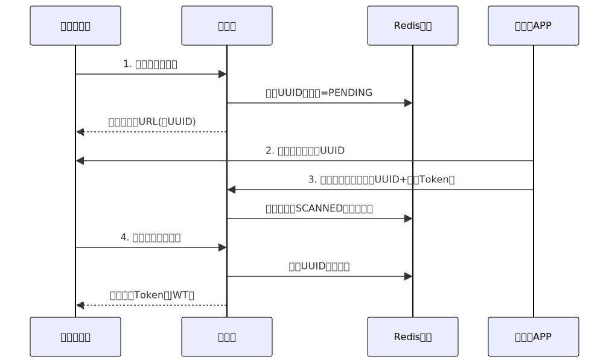

# 背景

二维码是....

存储原理：其实就是黑白表示 01 、

"二维码会用完吗"的问题，以33×33版本为例

识别错误率问题

# 场景1：扫码登入

面试输出：

- **二维码生成**：服务器生成一个唯一标识（UUID 或 Token），用于**区分每次扫码请求**。
- **扫码状态**：

前端不断请求服务器，询问二维码的状态（未扫描、已扫描、已确认）。【定时轮询  

前端只需监听 WebSocket，不需要轮询请求，扫码成功后立即推送状态  【长轮训 时效性

**短轮询**：

- 服务器资源：高并发请求处理压力
- 实现复杂度：简单，标准HTTP请求即可

**长轮询**：

- 服务器资源：需要维护大量持久连接（弊
- 实现复杂度：较高，需处理连接超时和重连（弊

- **扫码成功后验证**：验证后，生成会话（Session 或 JWT）

# 场景二：支付二维码、美团单车扫码

本质就是个链接而已

美团单车扫码：这个二维码内含（车辆ID

请求后 就是