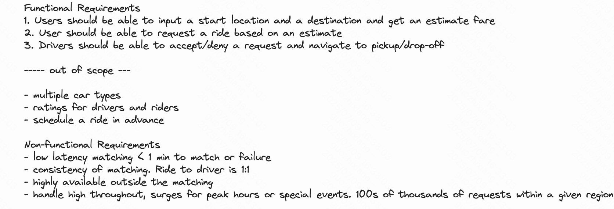
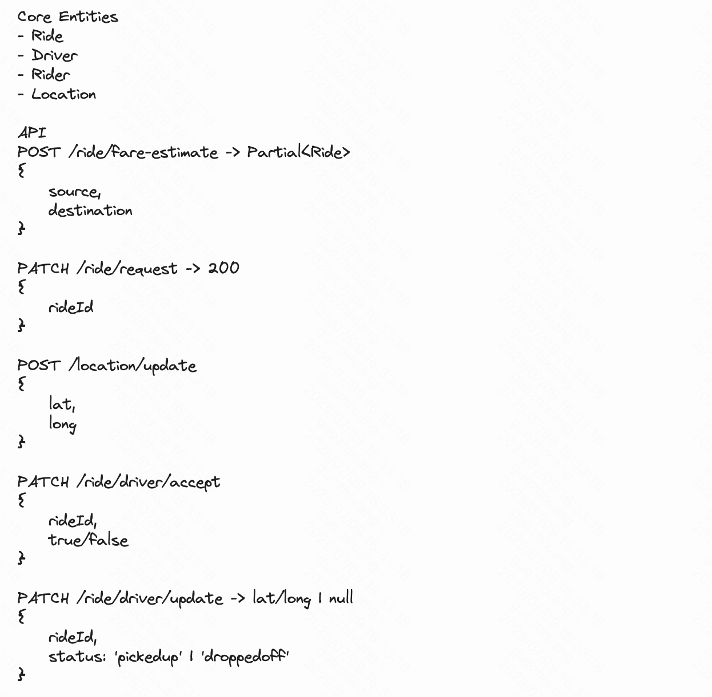
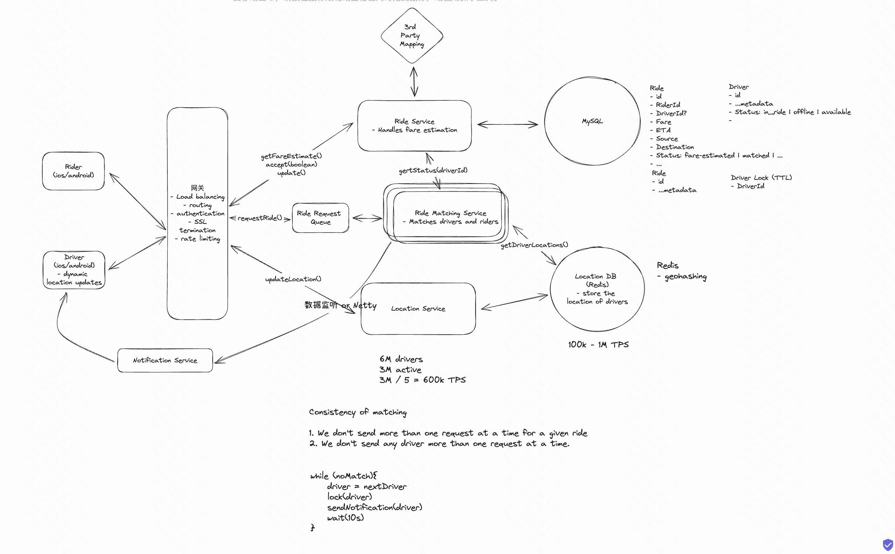

#  System Design Learning Notes

- **实战化**：总结系统分析步骤，聚焦真实业务场景中的架构挑战与应对，如缓存不一致、MQ补偿、热点Key治理等
- **系统性**：覆盖系统设计中的主干知识：缓存、消息队列、限流、分布式事务等
-  **面试向**：内容结构清晰，便于高效复习系统设计重点，适合作为面试冲刺材料

---

## Docs

- [The System Design Primer](https://github.com/donnemartin/system-design-primer) 
- [Awesome System Design](https://github.com/madd86/awesome-system-design) 
- [Interview-Notebook](https://github.com/CyC2018/Interview-Notebook) 

# 流程

功能 非功能设计

实体设计 + API设计

数据流转 + 方案trade-off

Dive In

三高一套方案分析 
