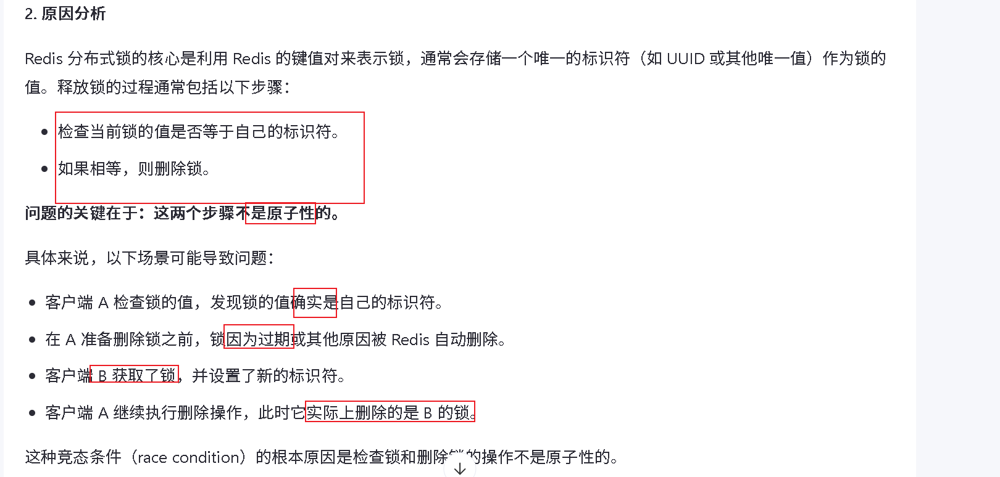

分析瓶颈是什么

高流量进入

高TPS？

https://juejin.cn/post/7203136448333332535

# 分布式锁




性能

1. 缓存~考虑一堆问题、性能提升： hotkey 下推、主从，分片等
2. 异步优化：
3. 多线程处理


分片

edis 热点 key 拆成 hot_key_0 ~ hot_key_n

MySQL 单表分库分表（用户表按 user_id mod 64 拆分

副本：

Redis 哨兵架构 + 读写分离

MySQL 主从复制，主写从读

⚠️ 缺点：副本存在延迟，不适合强一致场景


多写合并：

- 秒杀扣库存先写 Redis 再异步写数据库
- 高并发更新计数器：先累计在内存中，定时批量持久化


高热点key ： 随机因子拆分

1. 桶间库存分配不均问题

**现象**：某些桶已售罄，而其他桶仍有库存
**原因**：随机分配导致各桶库存消耗不均匀

2. 库存碎片问题

**现象**：每个桶都剩余少量库存，但总和仍大于0
**原因**：请求被随机分散到不同桶

```plain
// 初始化时记录有库存的桶
Set<Integer> availableBuckets = new ConcurrentHashSet<>();
for(int i=0; i<BUCKET_COUNT; i++) {
    availableBuckets.add(i);
}

public boolean seckill(Long itemId) {
    // 从可用桶中随机选择
    Integer[] buckets = availableBuckets.toArray(new Integer[0]);
    if(buckets.length == 0) return false;
    
    int bucket = buckets[ThreadLocalRandom.current().nextInt(buckets.length)];
    Long remain = redis.decr("stock:"+itemId+":bucket_"+bucket);
    
    if(remain >= 0) {
        if(remain == 0) {
            // 该桶库存耗尽，移出可用集合
            availableBuckets.remove(bucket);
        }
        return true;
    } else {
        // 该桶库存不足，移出可用集合
        availableBuckets.remove(bucket);
        // 重试其他可用桶
        return seckill(itemId);
    }
}
```


最适合使用这种方案的业务通常具有以下特点：

1. **写操作远多于读操作**
2. **可以接受短时间的数据不一致**
3. **对写入性能要求极高**
4. **数据可拆分计算**（如计数器、求和等）

短视频点赞/观看数统计

电商秒杀商品库存

社交平台粉丝数统计

新闻文章阅读量统计

对于读多写少或要求强一致性的场景，可能需要考虑其他方案如本地缓存+异步刷新等

# 高可用

接口防刷

 比如一个用户最多只能请求5次，一个IP最大请求10次等等。

接口限流

防止洪峰崩掉

MQ 异步，

# eg 到家


todo：

lua必要性、lua扣了 db宕机怎么办 、lua执行一半宕机、