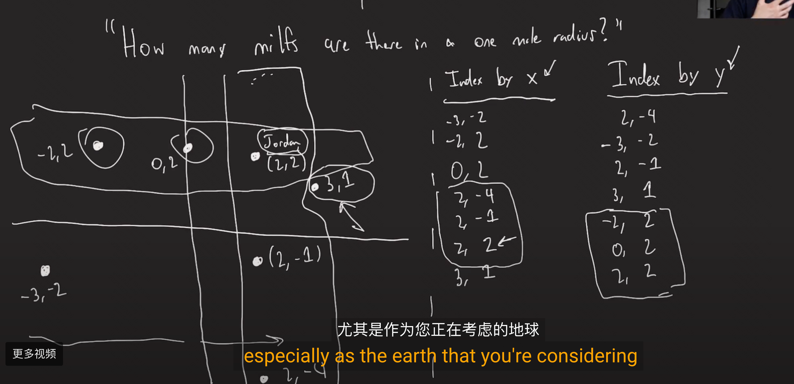
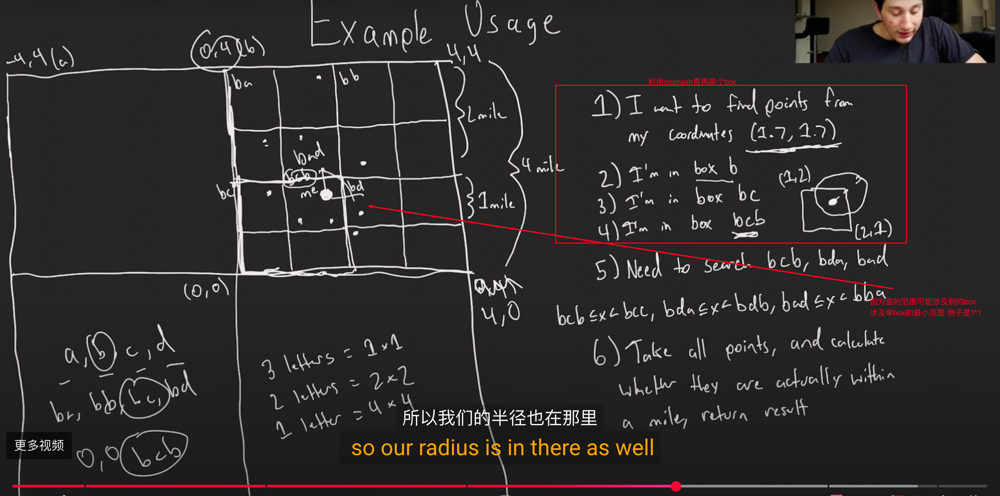
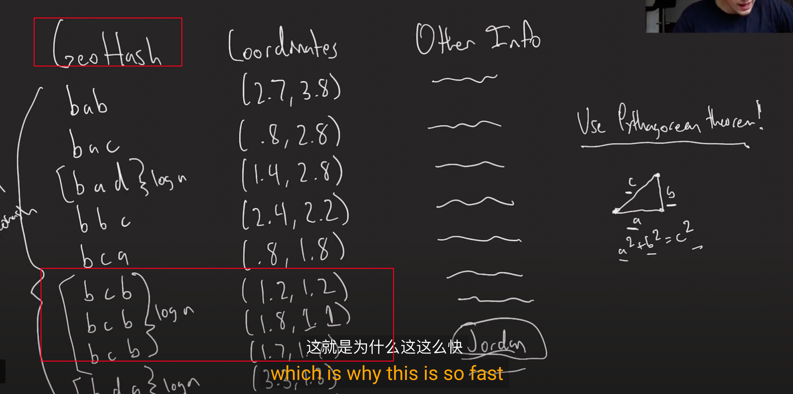

# 背景

Find all points within some distance 像美团、Uber、Tinder

美团 获取3km以内商家「Tips：考察地理查询 技术方案选型」

Uber 实现附近订单匹配系统「考察空间关联查询与实时性」


**考察点**：

- 地理空间数据的存储与索引方式 【db存 经纬度两个字段
- 查询耗时【index 可发展地方
- 不同技术方案的优缺点比较

- 对于大规模数据怎么办【就是sharding思想、按城市或区域


回答模板：

1. 讲解 indexin方案 装B 并且体现你的trade-off思想
2. 这里再讲下查商家「基本上不更新 可单独走db」 和 骑手「实时更新 redis 高写入」 两个场景的设计
3. **存储层**：MySQL存商家经纬度+8位Geohash（索引列），Redis缓存热点商家GEO数据。
4. **查询层**：「降级策略讲好」

- 先按`**GEORADIUS**`查Redis，无结果则查DB（`**WHERE geohash LIKE 'wx4g%'**`）。
- 对结果用Haversine公式「两点距离公式」精确排序。

1. **三高设计** + 优化
2. 客户端信息接收 就是推拉模型的trade-off了 「上述只是服务端 CUD」


#### **1. 高并发（High Concurrency）**

- **读写分离**：

- 商家信息等低频更新数据：MySQL主从集群 + 从库读扩展。
- 骑手位置等高QPS数据：Redis Cluster分片（如按城市分片`**geo:beijing**`）。

- **批量合并写入**：

- 20万TPS位置更新 → 通过**双缓冲队列** + **时间窗口**合并为5万TPs

#### **2. 高可用（High Availability）**

- **多级降级**：

- **一级降级**：Redis故障时切到DB查询（Geohash索引兜底）。
- **二级降级**：DB超时返回本地缓存（如Guava Cache存储最近5分钟数据）。

- **心跳检测**：

- WebSocket/MQTT长连接心跳（30秒间隔），自动剔除僵死节点。

- **集群容灾**：

- Redis Sentinel或Cluster模式，避免单点故障。

#### **3. 高性能（High Performance）**

- **冷热数据分离**：

- 热数据（活跃城市）独占Redis实例，冷数据归档到DB。

- **查询优化**：

- **Geohash预计算**：商家数据写入时8位Geohash并存索引。
- **多级缓存**：Redis → DB

# Indexing 技术方案

## Index x or y in 「like MySQL」



Jordan是user

我可以发现 无论对 index x上、会漏 x=3 

对 y

总的来说全扫描、全表扫码的危害 ->慢的一B

## Geohash index 「」



DB




实际操作

1. 说白了就是DB 加个Geohash的列 索引

```sql
SELECT * FROM businesses 
WHERE geohash LIKE 'wx4g%' //Index
AND category = 'restaurant'
AND rating > 4.0
ORDER BY ST_Distance_Sphere(point(lng, lat), point(116.404, 39.915)) ASC
LIMIT 20
```

当然可能精度缺失 不一定准确 

Geohash+距离计算：查出来 自己算下即可 「基本上没那么高精度场景」

1. **Geohash精度选择**：「要记下」

- 8位精度：约19米误差（适合附近商家查询）
- 6位精度：约610米误差（适合城市级查询）

1. **边界问题处理**：

- Geohash的边界效应（相邻区域可能前缀不同）
- 解决方案：查询中心点周围的8个相邻Geohash块


框架：Redis Geo原理就是这个

数据结构

- GEO 数据全部存储在 **ZSET** 结构中
- Key：用户定义的 GEO 集合名称
- Member：地点标识（如商家ID、用户ID等）
- Score：经过编码的 52 位 Geohash 值（double 类型存储）

Geohash 编码转换

- 将经纬度转换为 Geohash：

- 经度范围 [-180,180] → 映射到 [0,2^26]
- 纬度范围 [-90,90] → 映射到 [0,2^26]


大概原理是这个：

推荐实际使用：Redis + DB 经典两级查询「」

```sql
def update_location(user_id, lng, lat):
    # 1. 生成Geohash（服务端计算时）【也可以下发的客户端计算 发给我们
    geohash = geohash.encode(lat, lng, 8)
    
    # 2. 更新Redis（实时查询用）
    redis.geoadd("riders:geo", lng, lat, user_id)
    
    # 3. 异步写DB（持久化用）
    sql = "INSERT INTO rider_locations VALUES (%s, %s, %s, %s) ON DUPLICATE KEY UPDATE geohash=%s, lng=%s, lat=%s"
    db.execute_async(sql, (user_id, geohash, lng, lat, geohash, lng, lat))
def get_nearby_from_redis_then_db(lon, lat, radius):
    # 先从Redis查询
    redis_results = r.georadius("locations", lon, lat, radius, "km")
    
    if not redis_results:
        # Redis中没有，从数据库查询
        db_results = query_database(lon, lat, radius)
        
        # 将结果存入Redis
        for place in db_results:
            r.geoadd("locations", place['lon'], place['lat'], place['id'])
        
        return db_results
    else:
        # 从数据库获取详细信息
        detailed_results = []
        for place_id in redis_results:
            details = get_details_from_db(place_id)
            detailed_results.append(details)
        return detailed_results
```

这里缓存那一套了：降级DB 做限流 维度挺多的 不过看面试官和你发挥吧 QPS不高 不限流扛得住就好


思想1：20w TPS 更新 可能单机redis就支持5w怎么办 ->批量合并 20->5 每4条合并一次「可能会有延迟问题，等了很久第四个没来，写个时间窗口即可」 -> 实现：pipeline优化指令传输（合并 、


## Geo sharding

说白了就是不要直接 Geohash整个 世界 甚至中国

为什么：MD 要精度小<0.5km 的话 不知道几位了 【字段爆炸】 、并且你做redis存 有Big Key问题

所以基本上思想就是对每个 省会 城市去geohash 即确定**大box** 再递归去到你需要的精度**小box** 


## Quadtree

Quadtree是一种空间分割数据结构，递归地将二维空间划分为四个象限（象限通常称为NW、NE、SW、SE），直到满足终止条件

思想和geohash差不多 比如b box 【可能在这叫b节点 我要求box里面<500个商家 那大于就递归 直到满足条件


这里注意 这种结构是fit in memory的 **内存中**查

高更新的：结构调整问题


db不会满足这种 当然你要建立个表 然后来个children 字段什么的 那纯sb


## 三、Trade-off分析

### 1. 查询性能

- **点查询**：三者性能接近，Geohash可能稍快
- **范围查询**：

- Quadtree次之（需要遍历多个象限）
- Geohash需要处理边界问题

- **最近邻查询**：

- Quadtree需要额外算法支持
- Geohash需要扩展搜索相邻网格

### 2. 存储效率

- **Geohash**：存储紧凑，只需保存字符串
- **Quadtree**：内存消耗与数据分布和深度相关

### 3. 更新效率

- **Geohash**：更新单个点非常高效
- **Quadtree**：动态更新可能导致树不平衡

### 4. 实现复杂度

- **Geohash**：算法简单，容易实现
- **Quadtree**：需要处理树结构和空间划分

## 四、典型应用场景

### Geohash适合：

- 简单的位置服务（如附近的人）
- 示例：Redis GEO、简单的LBS应用

### Quadtree适合：

- 游戏开发（碰撞检测）
- 动态变化的空间数据
- 需要频繁更新的场景
- 示例：实时战略游戏、GIS前端渲染

### 

# 美团

商家这种 ：CUD基本上很少 

R：qps可能比较大 、方案1qps不高 主从下 搞个读写分离 即可 

方案2 还顶不住 上缓存


扩展：像骑手位置实时更新

其实就类似 Uber Tinder

# Uber Tinder 

背景：需要实时更新位置 实时写DB肯定顶不足 like high qps update ig

技术：精度要求 geohash重写问题（写redis还好，这种实时数据基本上存db没啥意义 「没瓶颈」

<details class="lake-collapse"><summary id="u8431445a"><span class="ne-text">推拉模型选取</span></summary><h4 id="op005" style="font-size: 16px; line-height: 24px; margin: 10px 0 5px 0"><strong><span class="ne-text" style="color: rgb(64, 64, 64)">方案1：推模型为主（强实时场景）</span></strong></h4><ul class="ne-ul" style="margin: 0; padding-left: 23px"><li id="ub69c635e" data-lake-index-type="0"><strong><span class="ne-text" style="color: rgb(64, 64, 64)">技术栈</span></strong><span class="ne-text" style="color: rgb(64, 64, 64)">：</span><strong><span class="ne-text" style="color: rgb(64, 64, 64)">WebSocket</span></strong><span class="ne-text" style="color: rgb(64, 64, 64)">（主流方案）：全双工通信，适合</span><strong><span class="ne-text" style="color: rgb(64, 64, 64)">高频小数据量</span></strong><span class="ne-text" style="color: rgb(64, 64, 64)">（如GPS坐标）。</span></li><li id="u40a05846" data-lake-index-type="0"><strong><span class="ne-text" style="color: rgb(64, 64, 64)">优化技巧</span></strong><span class="ne-text" style="color: rgb(64, 64, 64)">：</span></li></ul><ul class="ne-list-wrap" style="margin: 0; padding-left: 23px; list-style: none"><ul ne-level="1" class="ne-ul" style="margin: 0; padding-left: 23px; list-style: circle"><li id="ueeb70129" data-lake-index-type="0"><strong><span class="ne-text" style="color: rgb(64, 64, 64)">增量推送</span></strong><span class="ne-text" style="color: rgb(64, 64, 64)">：仅发送变化的经纬度或Geohash前缀（如从</span><code class="ne-code" style="font-family: SFMono-Regular, Consolas, Liberation Mono, Menlo, Courier, monospace; background-color: rgba(0, 0, 0, 0.06); border: 1px solid rgba(0, 0, 0, 0.08); border-radius: 2px; padding: 0px 2px"><strong><span class="ne-text" style="color: rgb(64, 64, 64); background-color: rgb(236, 236, 236)">wx4g0</span></strong></code><span class="ne-text" style="color: rgb(64, 64, 64)">→</span><code class="ne-code" style="font-family: SFMono-Regular, Consolas, Liberation Mono, Menlo, Courier, monospace; background-color: rgba(0, 0, 0, 0.06); border: 1px solid rgba(0, 0, 0, 0.08); border-radius: 2px; padding: 0px 2px"><strong><span class="ne-text" style="color: rgb(64, 64, 64); background-color: rgb(236, 236, 236)">wx4g1</span></strong></code><span class="ne-text" style="color: rgb(64, 64, 64)">）。</span></li><li id="u477b5062" data-lake-index-type="0"><strong><span class="ne-text" style="color: rgb(64, 64, 64)">连接保活</span></strong><span class="ne-text" style="color: rgb(64, 64, 64)">：客户端定时发送心跳包（如30秒一次），服务端检测僵死连接。</span></li><li id="u99a0cb4d" data-lake-index-type="0"><strong><span class="ne-text" style="color: rgb(64, 64, 64)">分频道推送</span></strong><span class="ne-text" style="color: rgb(64, 64, 64)">：按地理区域划分频道（如</span><code class="ne-code" style="font-family: SFMono-Regular, Consolas, Liberation Mono, Menlo, Courier, monospace; background-color: rgba(0, 0, 0, 0.06); border: 1px solid rgba(0, 0, 0, 0.08); border-radius: 2px; padding: 0px 2px"><strong><span class="ne-text" style="color: rgb(64, 64, 64); background-color: rgb(236, 236, 236)">geo:beijing</span></strong></code><span class="ne-text" style="color: rgb(64, 64, 64)">），减少广播风暴。</span></li></ul></ul><h4 id="497a3a25" style="font-size: 16px; line-height: 24px; margin: 10px 0 5px 0"><strong><span class="ne-text" style="color: rgb(64, 64, 64)">方案2：推拉结合（平衡架构）</span></strong></h4><ul class="ne-ul" style="margin: 0; padding-left: 23px"><li id="ufc4f6025" data-lake-index-type="0"><strong><span class="ne-text" style="color: rgb(64, 64, 64)">核心逻辑</span></strong><span class="ne-text" style="color: rgb(64, 64, 64)">：</span></li></ul><ul class="ne-list-wrap" style="margin: 0; padding-left: 23px; list-style: none"><ul ne-level="1" class="ne-ul" style="margin: 0; padding-left: 23px; list-style: circle"><li id="u583f673f" data-lake-index-type="0"><strong><span class="ne-text" style="color: rgb(64, 64, 64)">客户端</span></strong><span class="ne-text" style="color: rgb(64, 64, 64)">：首次通过HTTP拉取全量数据，之后通过WebSocket接收增量更新。</span></li><li id="u9b6e58fb" data-lake-index-type="0"><strong><span class="ne-text" style="color: rgb(64, 64, 64)">服务端</span></strong><span class="ne-text" style="color: rgb(64, 64, 64)">：维护版本号或时间戳，仅推送变更部分（如</span><code class="ne-code" style="font-family: SFMono-Regular, Consolas, Liberation Mono, Menlo, Courier, monospace; background-color: rgba(0, 0, 0, 0.06); border: 1px solid rgba(0, 0, 0, 0.08); border-radius: 2px; padding: 0px 2px"><strong><span class="ne-text" style="color: rgb(64, 64, 64); background-color: rgb(236, 236, 236)">{type: "update", data: {user1: [lng, lat]}}</span></strong></code><span class="ne-text" style="color: rgb(64, 64, 64)">）。</span></li></ul></ul></details>

- **美团外卖**：

- 骑手端 → TCP自定义协议（高频率位置上报+指令下发）。
- 用户端 → HTTP长轮询（每2秒拉取骑手位置）。